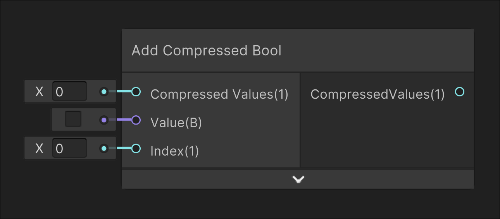

# Add Compressed Bool

## Image

## Description

Overwrites a value at a given index into the input CompressedValues
## Inputs

| Parameter        | Description                               |
| ---------------- | ----------------------------------------- |
| CompressedValues | Compressed int of bool values             |
| Value            | Value inserted into the CompressedValues  |
| Index            | Index that the input value will overwrite |

## Outputs

| Output           | Description                                 |
| ---------------- | ------------------------------------------- |
| CompressedValues | New compressed integer with the added value |
