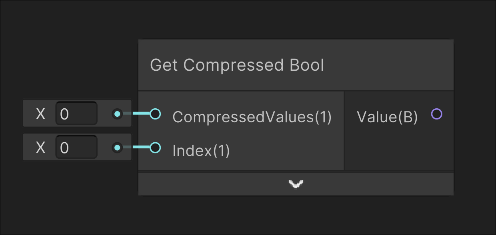

# Get Compressed Bool

## Image

## Description

Gets a compressed value at a given index from the input CompressedValues
## Inputs

| Input            | Description                                |
| ---------------- | ------------------------------------------ |
| CompressedValues | Compressed int of bool values              |
| Index            | Index of which bool value will be returned |

## Outputs

| Output | Description              |
| ------ | ------------------------ |
| Value  | Value at the given index |
