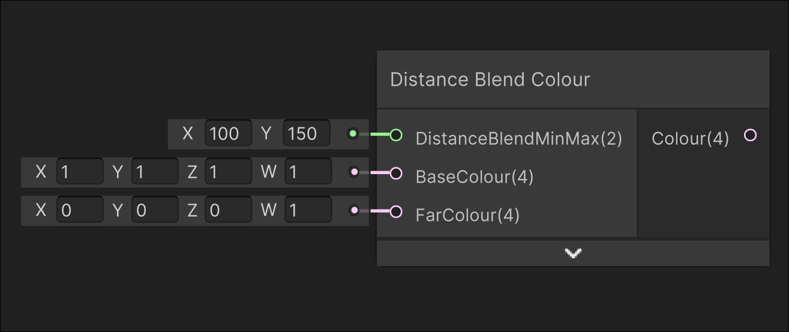

# Distance Blend Colour

## Image

## Description

Blends between two inputted colours based on the camera position
## Inputs

| Input               | Description                                                                                                  |
| ------------------- | ------------------------------------------------------------------------------------------------------------ |
| DistanceBlendMinMax | Blends from the BaseColour to FarColour using the world distance from the camera from X to Y                 |
| BaseColour          | The colour that starts from the camera to DistanceBlendMinMax.x                                              |
| FarColour           | The colour that starts blending in at DistanceBlendMinMax.x, and 100% of the colour at DistanceBlendMinMax.y |

## Outputs

| Output | Description       |
| ------ | ----------------- |
| Colour | The output colour |
