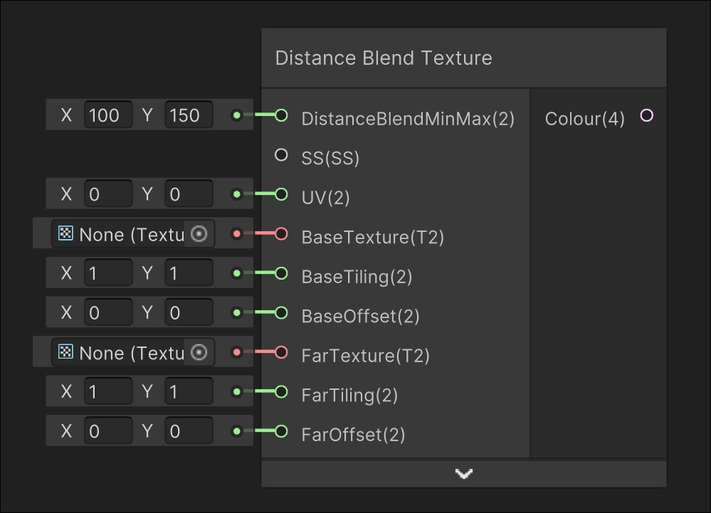

# Distance Blend Texture

## Image

## Description

Blends between two inputted textures based on the camera position
## Inputs

| Input               | Description                                                                                                   |
| ------------------- | ------------------------------------------------------------------------------------------------------------- |
| DistanceBlendMinMax | Blends from the BaseTexture to FarTexture using the world distance from the camera from X to Y                |
| SS                  | Sampler state used for sampling textures                                                                      |
| UV                  | UV used for sampling textures                                                                                 |
| BaseTexture         | The texture that starts from the camera to DistanceBlendMinMax.x                                              |
| BaseTiling          | Tiling used when sampling the base texture                                                                    |
| BaseOffset          | Offset used when sampling the base texture                                                                    |
| FarTexture          | The texture that starts blending in at DistanceBlendMinMax.x, and 100% of the colour at DistanceBlendMinMax.y |
| FarTiling           | Tiling used when sampling the far texture                                                                     |
| FarOffset           | Offset used when sampling the far texture                                                                     |

## Outputs

| Output | Description       |
| ------ | ----------------- |
| Colour | The output colour |

---