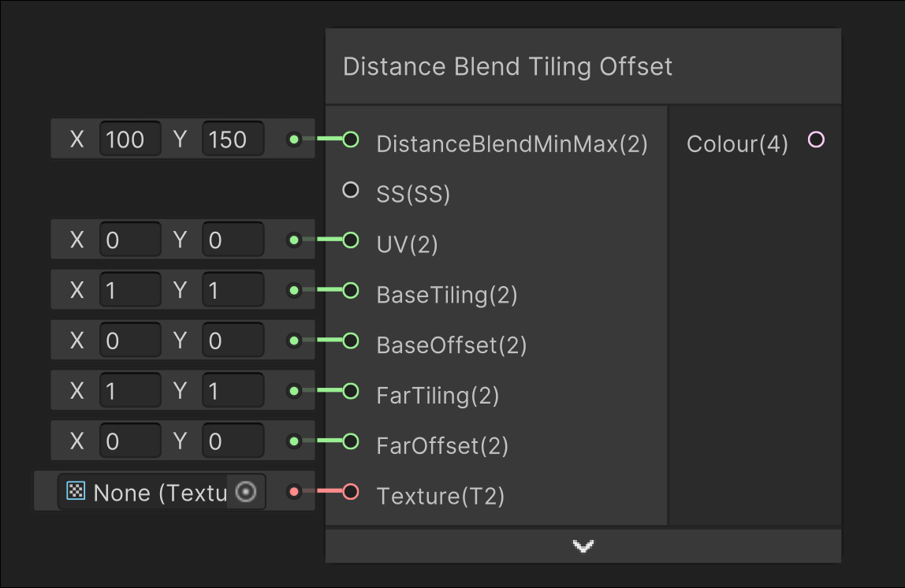

# Distance Blend Tiling Offset

## Image

## Description

Blends between an inputted texture with differing tiling and offset based on the camera position
## Inputs

| Input               | Description                                                                                                  |
| ------------------- | ------------------------------------------------------------------------------------------------------------ |
| DistanceBlendMinMax | Blends from the BaseTexture to FarTexture using the world distance from the camera from X to Y               |
| SS                  | Sampler state used for sampling the texture                                                                  |
| UV                  | UV used for sampling the texture                                                                             |
| BaseTiling          | The tiling that starts from the camera to DistanceBlendMinMax.x                                              |
| BaseOffset          | The offset that starts from the camera to DistanceBlendMinMax.x                                              |
| FarTiling           | The tiling that starts blending in at DistanceBlendMinMax.x, and 100% of the colour at DistanceBlendMinMax.y |
| FarOffset           | The offset that starts blending in at DistanceBlendMinMax.x, and 100% of the colour at DistanceBlendMinMax.y |
| BaseTexture         | The texture that will be sampled                                                                             |

## Outputs

| Output | Description       |
| ------ | ----------------- |
| Colour | The output colour |
