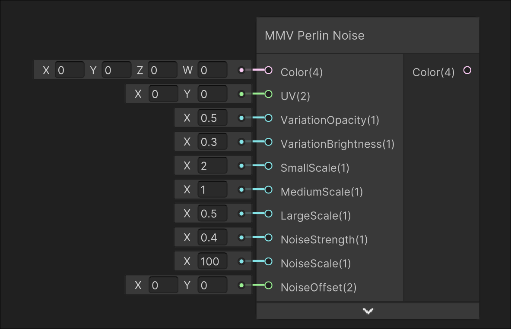

# MMV Perlin Noise

## Image

## Description

Outputs a variation colour based on perlin noise
## Inputs

| Input               | Description                                                        |
| ------------------- | ------------------------------------------------------------------ |
| Color               | Colour that is lerped between from this colour to variation colour |
| UV                  | UV used for sampling noise                                         |
| VariationOpacity    | Lerp factor from regular colour to variation colour                |
| VariationBrightness | Brightness added onto variation colour                             |
| SmallScale          | Scale for the small noise sampling                                 |
| MediumScale         | Scale for the medium noise sampling                                |
| LargeScale          | Scale for the large noise sampling                                 |
| NoiseStrength       | Strength of the noise                                              |
| NoiseScale          | Noise Scaling                                                      |
| NoiseOffset         | Noise Offset                                                       |

## Outputs

| Output | Description       |
| ------ | ----------------- |
| Colour | The output colour |
