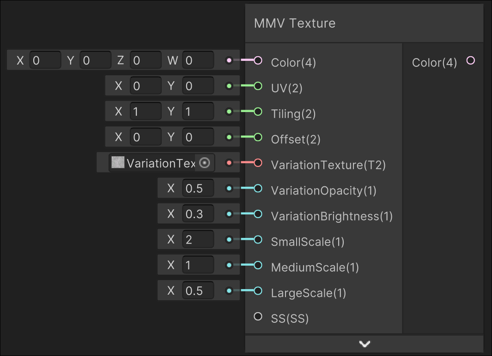

# MMV Texture

## Image

## Description

Outputs a variation colour based on an inputted texture
## Inputs

| Input               | Description                                                                |
| ------------------- | -------------------------------------------------------------------------- |
| Color               | Colour that is lerped between from this colour to variation texture colour |
| UV                  | UV used for sampling the texture                                           |
| Tiling              | Texture Tiling                                                             |
| Offset              | Texture Offset                                                             |
| VariationTexture    | Texture to be overlayed onto the colour                                    |
| VariationOpacity    | Lerp factor from regular colour to variation texture                       |
| VariationBrightness | Brightness added onto variation texure                                     |
| SmallScale          | Scale for the small texture sampling                                       |
| MediumScale         | Scale for the medium texture sampling                                      |
| LargeScale          | Scale for the large texture sampling                                       |
| SS                  | Sampler state used for sampling the texture                                |

## Outputs

| Output | Description       |
| ------ | ----------------- |
| Colour | The output colour |

---