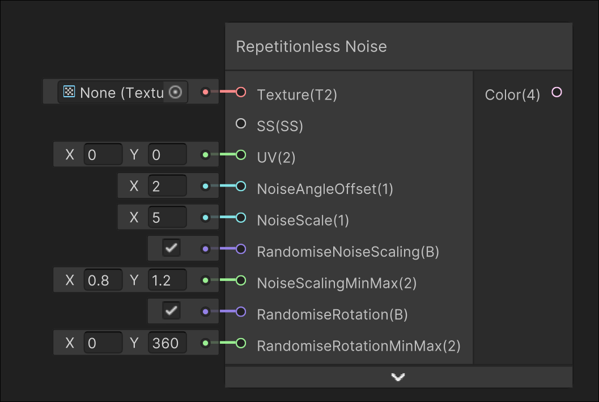

# Repetitionless Noise

## Image

## Description

Samples the given texture using modified UVs based on voronoi noise

Samples the voronoi cells base and edge colour if required and lerps them together
## Inputs

| Input                   | Description                                                                         |
| ----------------------- | ----------------------------------------------------------------------------------- |
| Texture                 | The texture to sample                                                               |
| SS                      | Sampler state used for sampling the texture                                         |
| UV                      | UV used for sampling the texture                                                    |
| NoiseAngleOffset        | Voronoi noise angle offset                                                          |
| NoiseScale              | Voronoi noise scale                                                                 |
| RandomiseNoiseScaling   | If the noise scaling is randomised. NoiseScalingMinMax is ignored if disabled       |
| NoiseScalingMinMax      | The range to randomly scale the noise                                               |
| RandomiseRotation       | If the noise rotation is randomised. RandomiseRotationMinMax is ignored if disabled |
| RandomiseRotationMinMax | The range in degrees to randomly rotate the noise                                   |

## Outputs

| Output | Description       |
| ------ | ----------------- |
| Colour | The output colour |

---