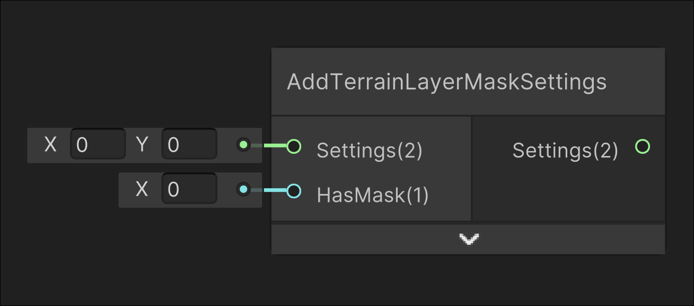

# Add Terrain Layer Mask Settings

## Image

## Description

`Intended for internal use`

Used in the Repetitionless Terrain shader to compress the HasMask value into the packed texture field in the compressed settings

## Inputs

| Input    | Description                         |
| -------- | ----------------------------------- |
| Settings | The BaseSettings for this layer     |
| HasMask  | The terrain layer _HasMask variable |

## Outputs

| Output   | Description               |
| -------- | ------------------------- |
| Settings | The modified BaseSettings |
