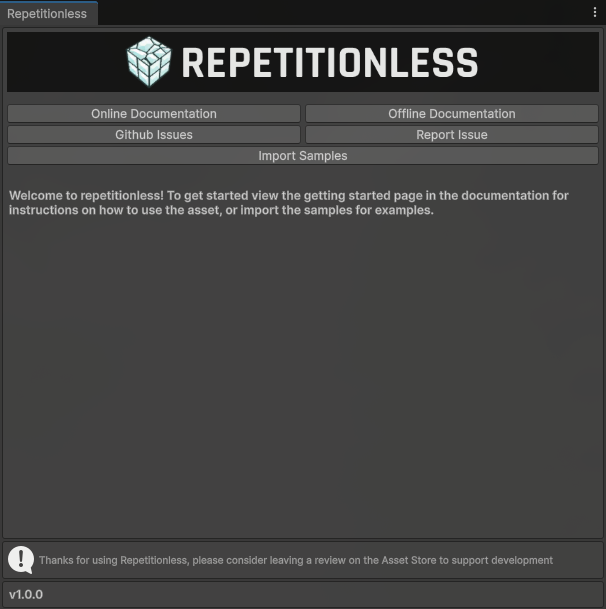

# Getting Started With Repetitionless

## Tutorial Video

TUTORIAL VIDEO HERE WHEN ITS FINISHED

## Welcome Screen

When first importing the asset you will be greeted with a welcome screen with buttons to:

- View Documentation
- View and Reporting issues
- Import samples

To open this window again, you can find it in the toolbar at 
`Windows > Repetitionless > Open Window`

## Sample Scenes

The asset comes with 3 example scenes that you can view to see the different features of repetitionless and how to implement the materials

For instructions on accessing the samples:

**View the [Samples page](samples.md)**

## Using A Repetitionless Material

For instructions on how to use the regular repetitionless shader:

**View the [Using Regular Materials Page](material-regular.md)**

For instructions on how to use the terrain repetitionless shader:

**View the [Using Terrain Materials Page](material-terrain.md)**

To view what each material property does:

**View the [Material Properties Page](material-properties.md)**

## Creating Shaders

You can view the Sub Graphs and Shader API documentation in the contents on the left of the page

If you want to create a shader graph or code shader using the features from the repetitionless materials:

**View the [Shader Creation page](shader-creation.md)**

## Creating Scripts

You can view the Sub Graphs and Shader API documentation in the contents on the left of the page

If you want to create scripts or inspectors using the features from the repetitionless materials inspectors:

**View the [Scripting page](scripting.md)**