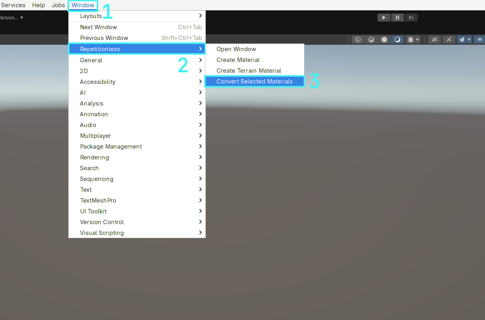
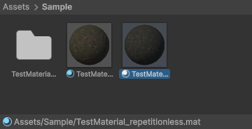

## Converting A Material

To convert a regular lit material to a repetitionless material:

1. Select the materials you want to convert
2. Open the windows tab in the toolbar
3. Navigate to `Repetitionless`
4. Click `Convert Selected Materials`
5. The materials will be created next to the original materials with the suffix "\_repetitionless"

**Important Details:**

- This will always convert to the same render pipeline as the input material
- This works for BIRP, URP, & HDRP standard lit materials, any others will not work