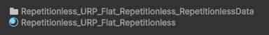

## Data Folder

All the properties and textures are stored in a folder along side the material named 
`<Material Name>_RepetitionlessData`

This folder is automatically handled and you do not need to worry about it

*This folder will automatically be moved and deleted with the material but will not be copied so if you need to copy a material you will need to manually copy the folder aswell*

## Texture Packing

All the textures are packed into texture arrays for less samples in the shader which are stored in the data folder along side the material. These can be modified by clicking the **Array Settings button** in the Material Properties section

Arrays are split into:

- AVTextures: Albedo (rgb), Variation (a)
- NSOTextures: Normal (rg), Smoothness (b), Occlussion (a)
- EMTextures: Emission (rgb), Metallic (a)
- BMTextures: Blend Mask (r)

*Only the required arrays are created*

***To view what each property does, visit the [Material Properties](material-properties.md) page***