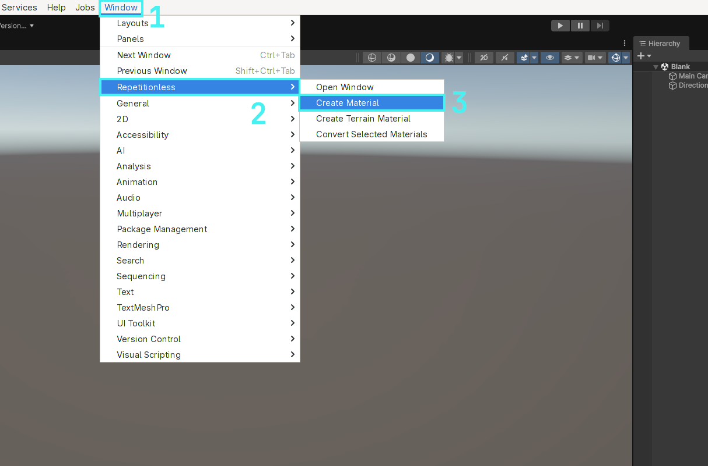
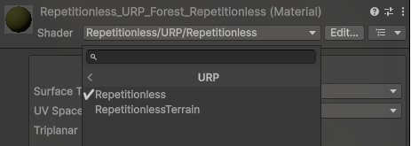

## Creating A Material

### Automatic

1. Open the windows tab in the toolbar
2. Navigate to `Repetitionless`
3. Click `Create Material`
4. The material will be created in the current folder in the project window

### Manual

1. Create a material
2. Select the shader dropdown
3. Navigate to `Repetitionless`
4. Select your render pipeline
5. Select `Repetitionless`

**Important Details:**

- Render pipelines can be switched without losing data. ex. Changing a Repetitionless material from BIRP to its URP version will keep all the settings
- Material data is stored in a folder along side the material named "{MaterialName}_Data". This is automatically moved and deleted with the material but it will need to be manually copied when copying the material

## Using The Material

You can just assign repetitionless material to any Mesh Renderer and it will be applied to that object

## Configuration

All the materials can be configured through its inspector by selecting the material and viewing the inspector window

***To view what each property does, visit the [Material Properties](material-properties.md) page***