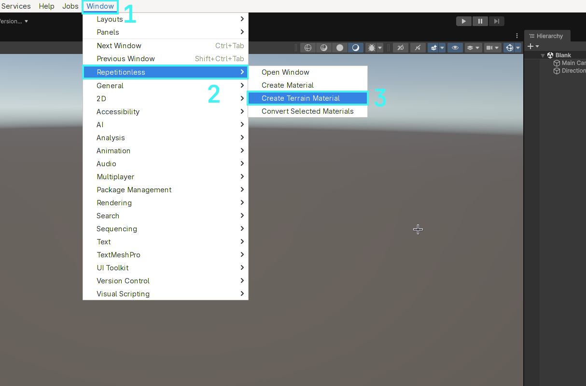
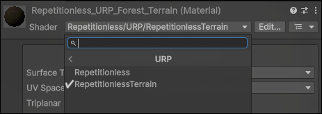
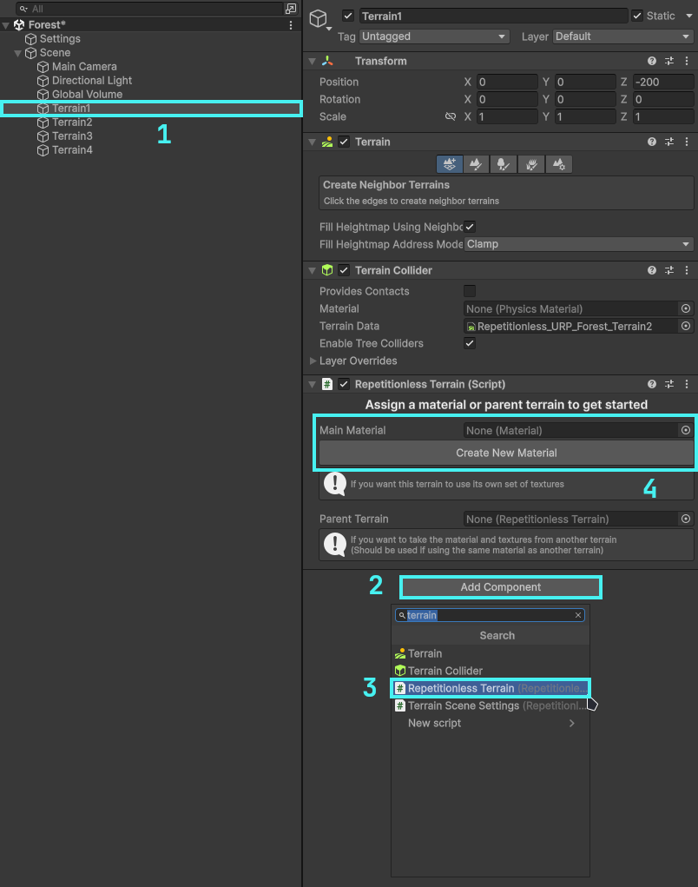
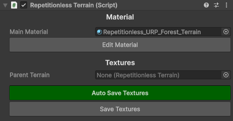
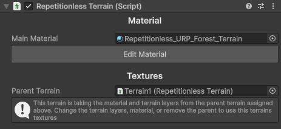
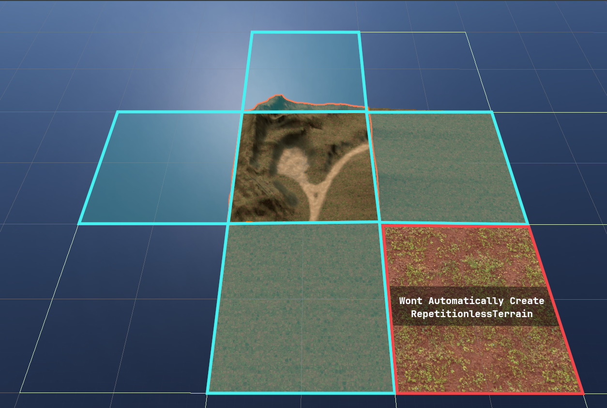
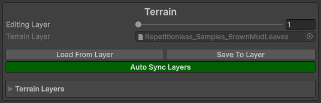
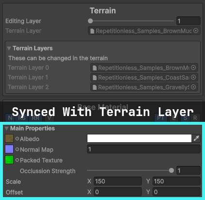
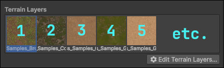

Repetitionless includes a custom script to handle and sync materials to unity terrains. To setup a terrain for the shader, follow the instructions below:

## Creating A Material

### Automatic

1. Open the windows tab in the toolbar
2. Navigate to `Repetitionless`
3. Click `Create Terrain Material`
4. The material will be created in the current folder in the project window

### Manual

1. Create a material
2. Select the shader dropdown
3. Navigate to `Repetitionless`
4. Select your render pipeline
5. Select `RepetitionlessTerrain`

**Important Details:**

- Render pipelines can be switched without losing data. ex. Changing a Repetitionless material from BIRP to its URP version will keep all the settings
- Material data is stored in a folder along side the material named "{MaterialName}_Data". This is automatically moved and deleted with the material but it will need to be manually copied when copying the material

## Setting Up A Terrain

To use a terrain with the repetitionless material you have to add a [`RepetitionlessTerrain`](Scripting/Repetitionless.Runtime.RepetitionlessTerrain.md) component to the terrain which can be done as follows:

1. Select the terrain you want to use
2. Select `Add Component`
3. Select `Repetitionless Terrain`

To add a material you can either:

- Click the `Create New Material` button
- Assign a material in the `Main Material` field

***Note the the material field will only allow Repetitionless Terrain materials***

## Using The Script

That is basically all you need to do! The script will handle the material assigning and texture syncing for you

With Auto Save Textures enabled, the terrain will sync whenever you update the terrain layers, updating the materials textures. With it disabled, it will not sync the textures until you click the Save Textures button.

**If you ever have any errors with the terrain, first see if clicking the Save Textures button fixes your issue. If it doesnt feel free to [submit a bug report](https://github.com/WilliamSchack/Repetitionless-Issues/issues/new/choose)**

## Using Multiple Terrains

The script also has a Parent Terrain field that when set will update that terrain to use the same material and layers from the parent. Keep in mind that when setting a parent terrain it will overwrite the current terrain layers you have set.

If a terrain has a parent, it will automatically update when the parent terrain updates, so using the save textures button on the main terrain will update all the children aswell.

**Important Details:**

- One parent terrain can be assigned to as many child terrains as you like
- Terrain Materials should only be synced to one set of terrain layers, but you can use the parent terrain field to get around that
- The parent terrain will automatically detach when you either change the terrain layers, or update the material

On terrains with the RepetitionlessTerrain, when using the Create Neighbour Terrains tool and creating a directly adjacent terrain, it will automatically add a RepetitionlessTerrain component to that terrain with the selected one as the parent. This will not work for non-adjacent terrains though as shown in the image above

## Editing The Terrain Layers

After modifying any field in the terrain layer and saving, it will automatically update those properties in any material that is linked to that layer if the auto sync is enabled. You can manually load or save to and from the layer with the buttons

The properties effected and what they link to include:

- Diffuse Map > Base Albedo Texture
- Normal Map > Base Normal Map
- Normal Scale > Base Normal Scale
- Mask Map > Base Packed Texture (Will enable packed texture when assigned)
- Metallic > Base Metallic
- Smoothness > Base Smoothness
- Tiling > Base Tiling
- Offset > Base Offset

## Editing The Material

If a terrain has been assigned, when editing the material it will show the terrain layers that it is linked to and each layer can be edited individually.

**Updating the Main Properties in the Base Material that have an equivalent in the terrain layer (listed above) will also automatically update the terrain layer**

Layers in the repetitionless material correspond to the order of the assigned terrain layers as shown in the image above

**The shader supports up to 32 terrain layers. Any more wont work and will appear white**

***Everything else is the same as the regular repetitionless material. To view what each property does, visit the [Material Properties](material-properties.md) page***