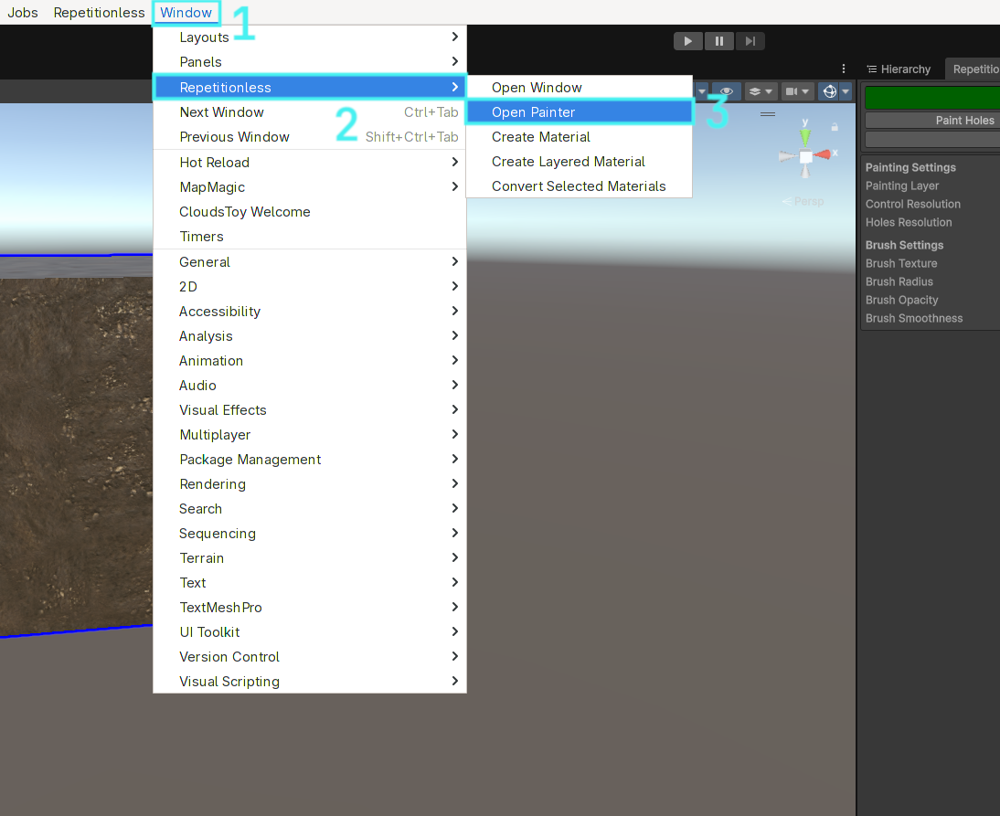
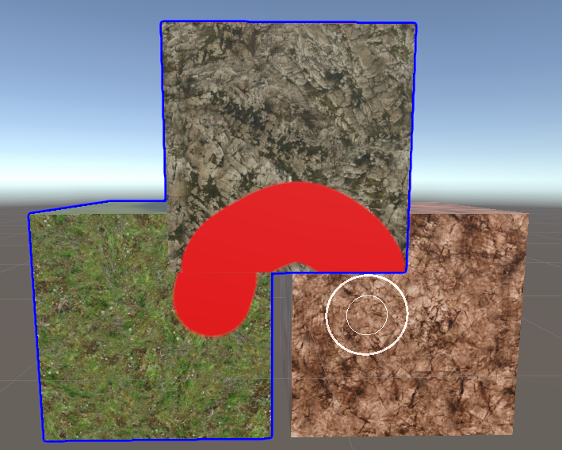
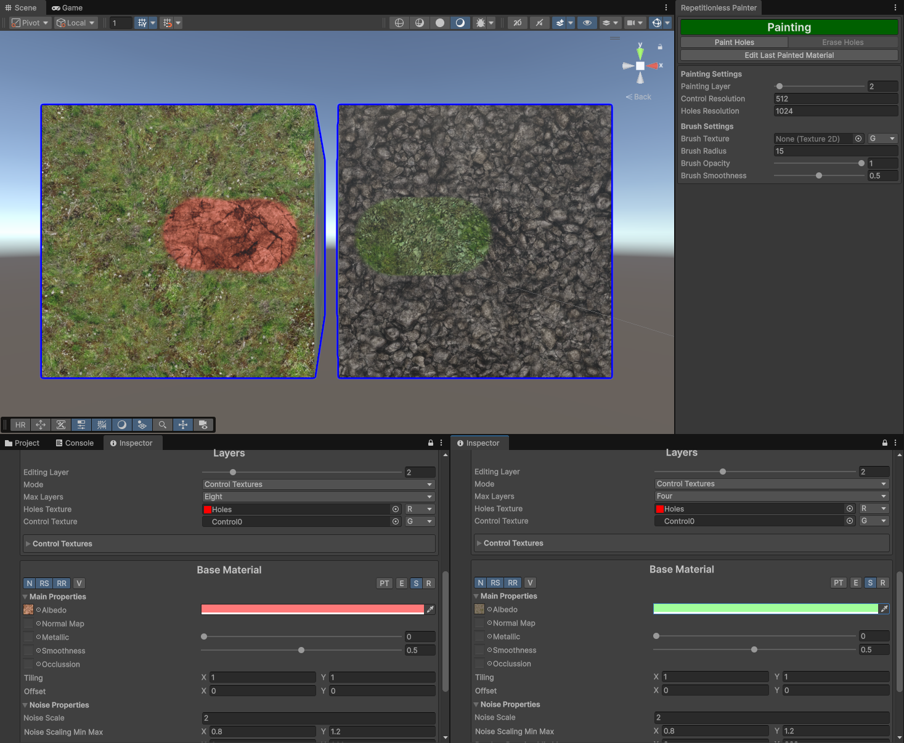
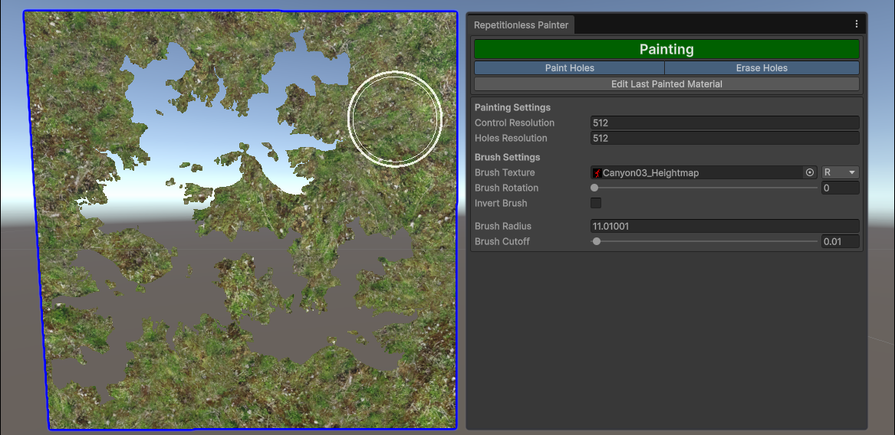
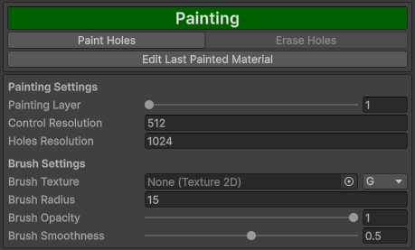
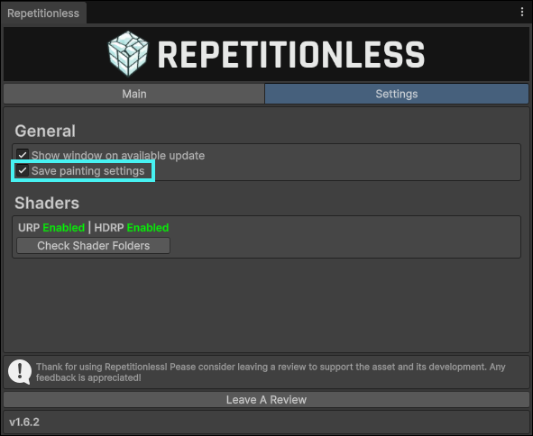
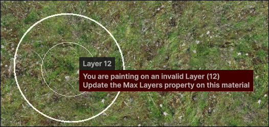
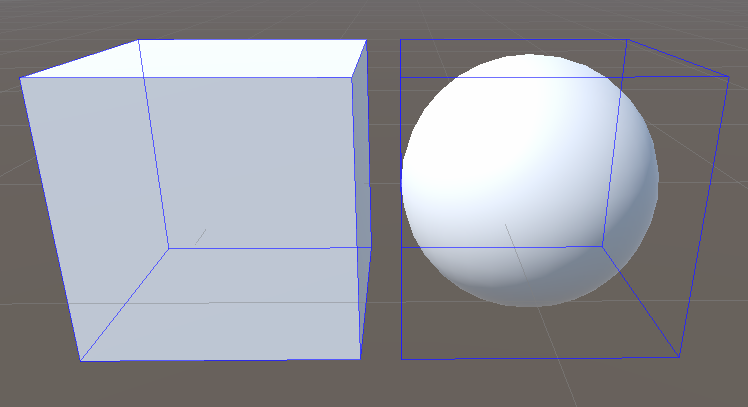

## Setting Up

You can open the painter window in the toolbar: 
`Window > Repetitionless > Open Painter`

Painting is only supported on objects that have the following:

- A mesh renderer with a Repetitionless Layered material (If the layer mode is not set to control textures it will automatically be converted)
- A mesh collider

Trying to paint any other object will do nothing

## Selection

When painting is enabled, clicking an object will automatically select it and start painting if the object can be painted

Objects that are selected for painting will have a dark blue outline around them. Trying to paint outside of any selected objects in one stroke will do nothing even if the unselected hovered object can be painted. It basically works as a mask

Regular object selection while painting is partially disabled. When selecting objects in the scene view it will use the painter selection, but you can select objects normally in the Hierarchy window

When an object is first selected, all the control textures will be created/resized, and the holes texture will be created/resized. This can take some time depending on your control/holes resolution settings

## Layers

The layer selection in the window is the selected layer for each material. This is per material and can be edited in its inspector. For example, layer 1 on one object could be different to layer 1 on another object as shown below

## Holes

Holes can be painted onto any object with the Paint Holes toggle

When Erase holes is enabled, painting over existing holes will erase them. This is visualised with an inner circle inside the brush when enabled

Since holes do not have transparency, when using a brush texture, you can adjust the cutoff to determine which parts of the texture will be counted as a hole. If a value at a given pixel is less than the cutoff, it will not be counted as a hole

## Properties

| Property           | Description                                                                                                                                  |
| ------------------ | -------------------------------------------------------------------------------------------------------------------------------------------- |
| Painting Layer     | The layer that will be painted. This is determined per material in its layer selection                                                       |
| Control Resolution | **Default:** 512 The resolution of the control textures. Existing textures will be automatically resized to this resolution               |
| Holes Resolution   | **Default:** 512 The resolution of the holes texture. Existing textures will be automatically resized to this resolution                  |
| Brush Texture      | The texture used for painting, if not set it will be a circle filling the radius. The channel is what channel to read from in the texture |
| Brush Rotation     | The rotation of the brush texture relative to the uvs of the painted object. This does nothing with no texture set                           |
| Invert Brush       | Inverts the brush texture, sampling it as (1 - value)                                                                                        |
| Brush Radius       | The size of the brush                                                                                                                        |
| Brush Cutoff       | The cutoff of the value for the brush texture where holes will not be drawn                                                                  |
| Brush Opacity      | he strength of the brush. The brush will accumulate so if you want opacity while dragging, set this to <= 0.05                               |
| Brush Smoothness   | What radius to start fading out the brush. This is visualised as the inner circle in the scene view                                          |

All properties can be auto saved and kept between painting sessions (enabled by default). You can toggle this by:

1. Opening the main window in the toolbar at `Window > Repetitionless > Open`
2. Click the settings tab
3. Toggle the setting called `Save painting settings`

## Keybinds

When using keybinds, they will always show with a popup next to the mouse so you know what you have just changed without looking at the window. This allows painting objects without having the window visible at all

Note that:

- Keybinds will only work when the scene view is focused
- Default actions with the below keybinds will be disabled while painting.

| Key            | Action                                                                                                                                                                                                |
| -------------- | ----------------------------------------------------------------------------------------------------------------------------------------------------------------------------------------------------- |
| A              | **Painting Control:** Changes the brush opacity **Painting Holes:** Changes the brush cutoff                                                                                                       |
| S              | Changes the brush Radius                                                                                                                                                                              |
| D              | **Painting Control:** Changes the brush smoothness **Painting Holes**: Toggles erasing holes                                                                                                       |
| C              | Changes the brush texture rotation                                                                                                                                                                    |
| F              | Focuses the scene camera to the mouse position                                                                                                                                                        |
| G              | Toggles painting                                                                                                                                                                                      |
| H              | Toggles painting holes                                                                                                                                                                                |
| Shift + Resize | **Compatible with Opacity, Cutoff, Radius, Smoothness, & Rotation controls** Slows down the modification of a slideable property to x0.1 the default. Also shows an extra digit in the mouse popup |
| Shift + Click  | Deselects the hovered object                                                                                                                                                                          |
| Shift + Scroll | Changes the painting layer                                                                                                                                                                            |
| Control (Hold) | Inverts the brush                                                                                                                                                                                     |

## Caveats

### Pre Unity 2022

Below Unity 2022 there is no cheap built in way to draw outlines around the selected objects. In these versions a wire cube is drawn around the bounds of selected objects instead.

### UVs

A mesh must have no overlapping or mirrored UVs for painting to properly work everywhere. If there is any overlapping or mirrored UVs, painting will only work on one of the islands, and for any other islands nothing will be painted.

Note that:
- Painting on the island that works will reflect to all other overlapping islands
- The island that is paintable is unknown as it is the last one that was baked