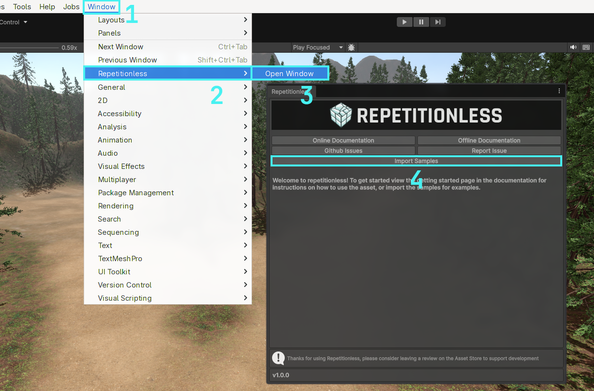
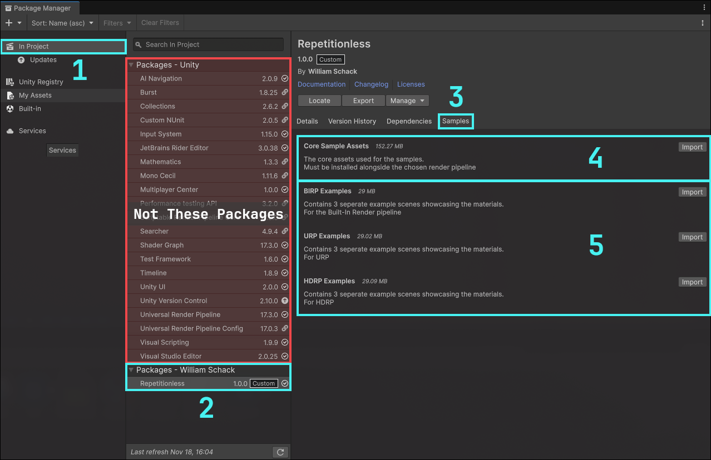
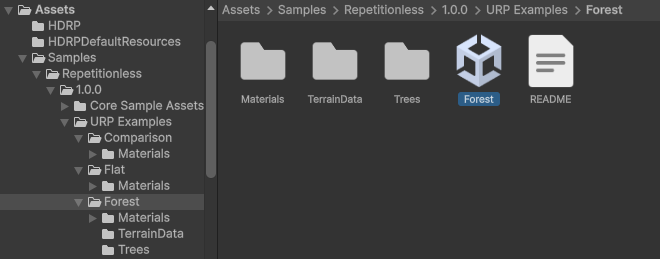
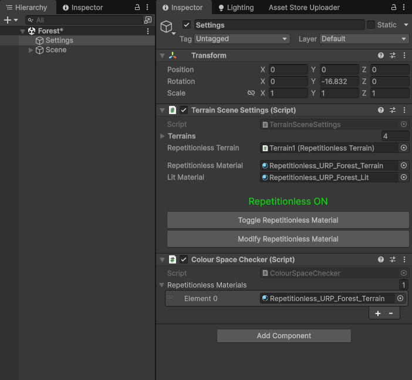

Samples are located in a folder which is hidden by default. To import the samples:

## Automatic Installation

1. Open the windows tab in the toolbar
2. Navigate to `Repetitionless`
3. Click `Open Window`
4.  Click the import samples button and it will automatically import your current render pipelines samples

## Manual Installation

1. Open the Unity Package Manager and navigate the packages in the project
2. Select Repetitionless under `In Project > Packages - William Schack` *(Not `Packages - Asset Store`)*
3. Go to the samples tab
4. Click import on the `Core Sample Assets` before your render pipeline
5. Click import on the examples for your current render pipeline (`<RP> Examples`)

## Opening The Samples

Samples will now be located in `Assets/Samples/Repetitionless/<CurrentVersion>/<RP> Examples`

To open the sample scenes you can go to their respective folders and open the scene

*The Core Sample Assets folder stores the base assets for all the samples, this must be imported for the samples to work*

## Sample Settings

The samples have a settings object that has buttons to:

- Toggle between the repetitionless and regular lit materials
- Modify and view the material settings used

*(The Colour Space Checker is used to make sure the textures are packed in the correct colour space, it is not needed after the scene is opened for the first time)*