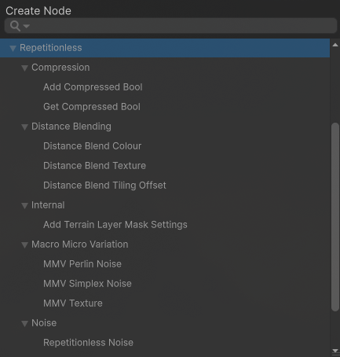

## Shader Graphs

To create a shader graph using the included sub-shaders, you can find the sub shaders in the shader graph under `Create Node > Repetitionless`

To view details about each sub-shader, view the corresponding Sub Graphs page in the contents of the left of the page

## Shader Code

For creating your own shaders using the included shaders, view the respective Shader API pages in the contents of the left of the page for details on each set of functions and how to implement them into your own code

Shaders can be found at `Packages/com.williamschack.repetitionless/Shaders/HLSL`
