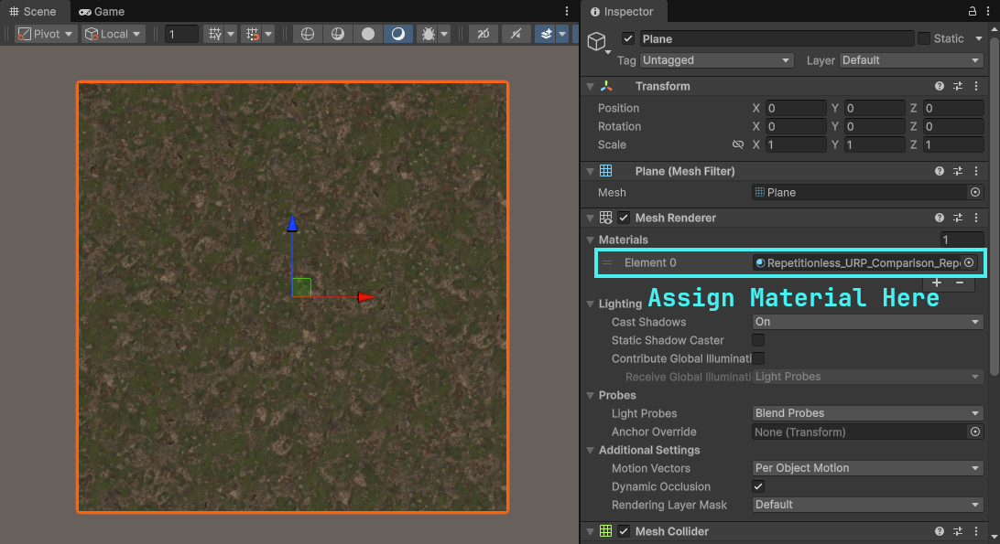
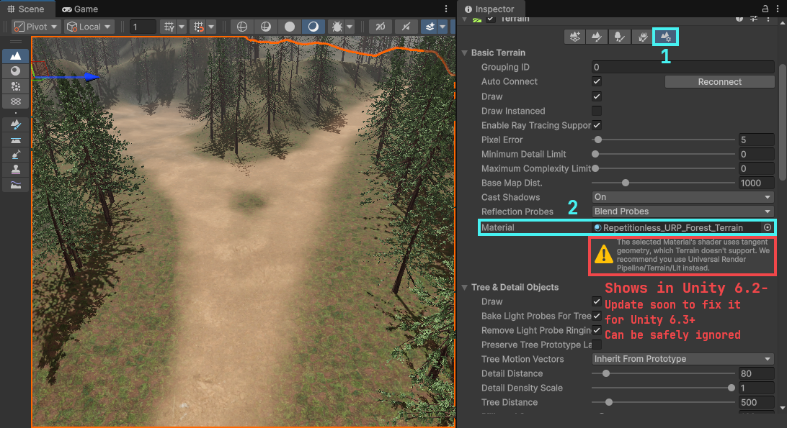
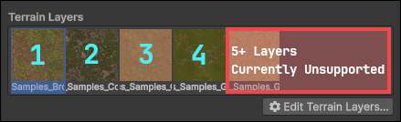
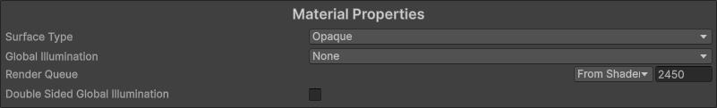
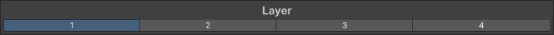
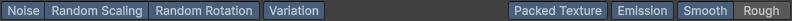
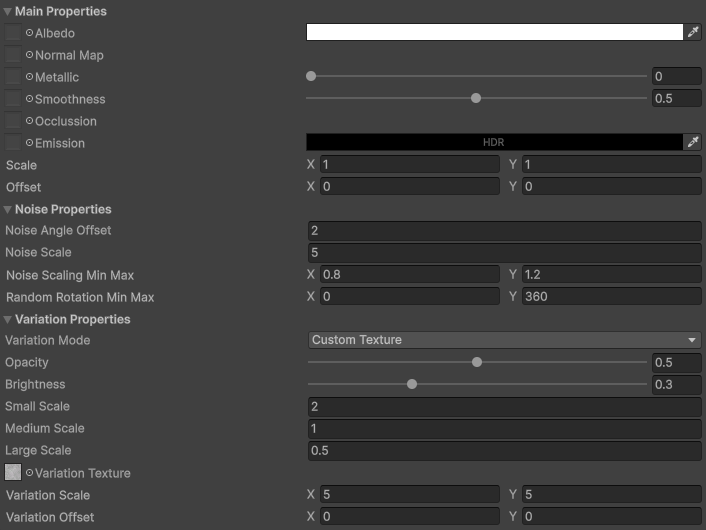
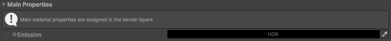

## Material Creation

Repetitionless comes with 2 premade shaders:

- Repetitionless: single layer repetitionless material for regular meshes
- RepetitionlessTerrain: multi-layer repetitionless material for Unity Terrains

To create one of these materials:

1. Create a material
2. Select the shader dropdown
3. Navigate to `Repetitionless`
4. Select your render pipeline
5. Select either shader

***Note: Render pipelines can be switched without losing data ex. Changing a Repetitionless material from BIRP to its URP version will keep all the settings***

## Using The Material

### Repetitionless

You can just assign repetitionless material to any Mesh Renderer and it will be applied to that object

### RepetitionlessTerrain

**Important Details**

- **Your Graphics API must support 64+ texture parameters.** This means graphics apis such as OpenGL and WebGL are not supported. You will know your graphics api is unsupported if you get the texture parameters warning and the shader doesnt work
- **Currently only supports 4 terrain layers.** An update to this package is coming soon for Unity 6.3+ to support ~8 terrain layers

To assign the terrain repetititonless material you have to:

1. Go to the terrain settings in its inspector
2. Assign the material to the material property

<i>There is a warning for tangent geometry because the shader is using the Lit Shader Graph which includes tangent geometry that cannot be disabled. <b>The repetitionless shader does not use tangent geometry and this warning can be safely ignored</b></i>

**An update to this package is coming soon for Unity 6.3+ that will remove this warning**

---

Layers in the repetitionless material correspond to the order of the assigned terrain layers as shown in the image above

**The material currently only supports 4 terrain layers.** An update to this package is coming soon for Unity 6.3+ to support ~8 terrain layers

## Configuration

All the materials can be configured through its inspector by selecting the material and viewing the inspector window

Below are all the available material settings in the inspectors

## Material Properties

Has all the general properties for the material

| Property                         | Description                                                                                     |
| -------------------------------- | ----------------------------------------------------------------------------------------------- |
| Surface Type                     | The surface type of the material 0: Opaque 1: Cutout 2: Transparent                    |
| Global Illuminattion             | Controls if the global illumination is baked or realtime 0: Realtime 1: Baked 2: None  |
| Render Queue                     | Changes when the material is drawn                                                              |
| Double Sided Global Illumination | If the lightmapper accounts for both sides of the geometry when calculating Global Illumination |

## Terrain Layer

The selected layer show that specific layers settings below. This index is based on the order of the terrain layers in the terrain object

**This is only shown if using the RepetitionlessTerrain material**

## Toolbar

Each material has a toolbar with various settings

Each settings text will shrink to the first letters of each word if the inspector width is too small for the whole words to fit

| Setting         | Description                                                                                                                                                                 |
| --------------- | --------------------------------------------------------------------------------------------------------------------------------------------------------------------------- |
| Noise           | Adds random scaling & rotation based on voronoi noise                                                                                                                       |
| Random Scaling  | Adds random scaling to each voronoi cell *Only shown if Noise is enabled*                                                                                                |
| Random Rotation | Adds random rotation to each voronoi cell *Only shown if Noise is enabled*                                                                                               |
| Variation       | Adds random variation on top of the albedo color **Using a custom texture can cause visible tiling**                                                                     |
| Packed Texture  | If you are using a packed texture of multiple regular ones (Better for performance) R: Metallic G: Occlussion A: Smoothness/Roughness                              |
| Emission        | If Emission is enabled                                                                                                                                                      |
| Smooth/Rough    | Toggles between the smoothness and roughness texture **If you are using a packed texture it will sample it with a smoothness or roughness texture based on this toggle** |

## Material Settings

Contains all the settings for a material. Settings can be enabled and disabled through the toolbar

This is shown for each enabled material (Base material, distance blend material, blend material)

### MainProperties

| Property             | Description                                                                                                                                                                                                                    |
| -------------------- | ------------------------------------------------------------------------------------------------------------------------------------------------------------------------------------------------------------------------------ |
| Albedo               | Albedo (RGB), Transparency (A)                                                                                                                                                                                                 |
| NormalMap            | Normal map                                                                                                                                                                                                                     |
| Metallic             | Metallic (R), other channels are ignored                                                                                                                                                                                       |
| Smoothness/Roughness | Smoothness/Roughness (R), other channels are ignored *Changes between smoothness and roughness based on toolbar setting*                                                                                                    |
| Occlussion           | Occlussion (R), other channels are ignored                                                                                                                                                                                     |
| Emission             | Emission (RGB)                                                                                                                                                                                                                 |
| Packed Texture       | The mask map for the current material R: Metallic G: Occlussion A: Smoothness/Roughness - *Only shown if Packed Texture is enabled* - *Alpha toggles between smoothness and roughness based on toolbar setting* |
| Occlussion Strength  | The occlussion strength of the packed texture occlussion *Only shown if Packed Texture is enabled*                                                                                                                          |
| Scale                | The texture tiling                                                                                                                                                                                                             |
| Offset               | The texture offset                                                                                                                                                                                                             |

***If you are using the RepetitionlessTerrain material, the main properties (except emission) will be taken from the respective terrain layer***

### Noise Properties

These are only shown if Noise is enabled in the toolbar

| Property                | Description                                                                                                                                                            |
| ----------------------- | ---------------------------------------------------------------------------------------------------------------------------------------------------------------------- |
| Noise Angle Offset      | The angle offset of the voronoi noise                                                                                                                                  |
| Noise Scale             | The scale of the voronoi noise                                                                                                                                         |
| Noise Scaling Min Max   | Range that each voronoi cell is randomly scaled by x: Min Scale y: Max Scale *Only shown if Random Scaling is enabled in the toolbar*                         |
| Random Rotation Min Max | Range that each voronoi cell is randomly rotated by x: Min Rotation Degrees y: Max Rotation Degrees *Only shown if Random Rotation is enabled in the toolbar* |

### Variation Properties

These are only shown if Variation is enabled in the toolbar

| Property          | Description                                                                                                                                                                  |
| ----------------- | ---------------------------------------------------------------------------------------------------------------------------------------------------------------------------- |
| Variation Mode    | The variation mode used Using a custom texture can cause visible tiling 0: Perlin noise 1: Simplex noise 2: Custom texture                                       |
| Opacity           | Transparency of the variation                                                                                                                                                |
| Brightness        | Intensity of the variation                                                                                                                                                   |
| Small Scale       | Scale of the small variation sample                                                                                                                                          |
| Medium Scale      | Scale of the medium variation sample                                                                                                                                         |
| Large Scale       | Scale of the large variation sample                                                                                                                                          |
| Noise Strength    | Strength of the noise *Only shown if Variation Mode is set to any noise*                                                                                                  |
| Noise Scale       | The noise tiling *Only shown if Variation Mode is set to any noise*                                                                                                       |
| Noise Offset      | The noise offset *Only shown if Variation Mode is set to any noise*                                                                                                       |
| Variation Texture | Texture that is drawn onto other materials, can cause visible tiling Variation (R), other channels are ignored *Only shown if Variation Mode is set to Custom Texture* |
| Variation Scale   | The variation tiling *Only shown if Variation Mode is set to Custom Texture*                                                                                              |
| Variation Offset  | The variation offset *Only shown if Variation Mode is set to Custom Texture*                                                                                              |

## Distance Blending

This is the material that will fade into the distance based on Distance Blend Min Max. Can be toggled by clicking the Distance Blending button

If the Blend Mode is set to Material, a seperate Material Settings will be shown below for the far material

| Property               | Description                                                                                                                                                              |
| ---------------------- | ------------------------------------------------------------------------------------------------------------------------------------------------------------------------ |
| Blend Mode             | Tiling Offset: Resamples materials with different Tiling and Offset Material: Samples a seperate far material                                                         |
| Distance Blend Min Max | Blend distance which the material will be sampled. Materials will be blended with regular material at min, and far material at max x: Min Distance y: Max Distance |
| Scale                  | The far tiling *Only shown if Blend mode is set to Tiling Offset*                                                                                                     |
| Offset                 | The far offset *Only shown if Blend mode is set to Tiling Offset*                                                                                                     |

## Material Blending

This is a separate material that will overlay the base and far material if set based on a mask. Can be toggled by clicking the Material Blending button

### Mask Settings

| Property      | Description                                                                                                                                                                                                     |
| ------------- | --------------------------------------------------------------------------------------------------------------------------------------------------------------------------------------------------------------- |
| Mask Type     | The mask type used 0: Perlin noise 1: Simplex noise 2: Custom texture                                                                                                                                  |
| Mask Opacity  | Opacity of the mask and in response the blend material                                                                                                                                                          |
| Mask Strength | The higher the value, the sharper the edges and vice versa                                                                                                                                                      |
| Noise Scale   | The noise tiling *Only shown if Mask Type is set to any noise*                                                                                                                                               |
| Noise Offset  | The noise offset *Only shown if Mask Type is set to any noise*                                                                                                                                               |
| Blend Mask    | Texture that is sampled as the mask for the blend material. Color from black-white represents opacity (0-1) Blend Mask (R), other channels are ignored *Only shown if Mask Type is set to Custom Texture* |
| Scale         | The blend mask tiling *Only shown if Mask Type is set to Custom Texture*                                                                                                                                     |
| Offset        | The blend mask offset *Only shown if Mask Type is set to Custom Texture*                                                                                                                                     |

### Distance Blending Settings

These are only shown if distance blending is enabled

| Property                   | Description                                                                           |
| -------------------------- | ------------------------------------------------------------------------------------- |
| Override Distance Blending | Draws the blend material on top of the far material                                   |
| Override Tiling & Offset   | Uses defined Tiling & Offset rather than distance blend Tiling & Offset               |
| Scale                      | The blend mask distance scale *Only shown if Override Tiling & Offset is enabled*  |
| Offset                     | The blend mask distance offset *Only shown if Override Tiling & Offset is enabled* |

## Debug

This will show the values of the selected option. Can be toggled by clicking the Debug button

| Option               | Description                                 |
| -------------------- | ------------------------------------------- |
| Voronoi Cells        | Outputs the value of each voronoi cell      |
| Edge Mask            | Outputs the edge mask for the voronoi cells |
| Distance Mask        | Outputs the distance mask                   |
| Blend Material Mask  | Outputs the blend material mask             |
| Variation Multiplier | Outputs the variation multiplier            |
